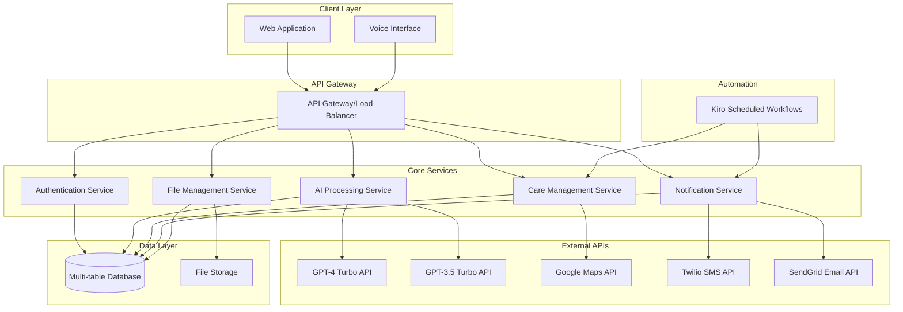
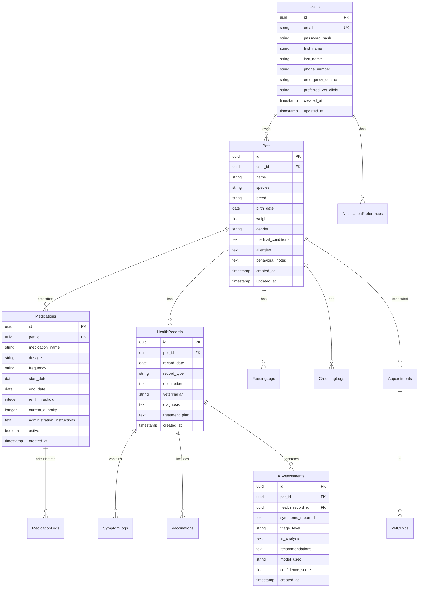

# Design Document: PawPal Voice Pet Care Assistant

## Overview

PawPal Voice Pet Care Assistant is an AI-native web application that combines advanced language models with voice interfaces to provide comprehensive pet care management. The system leverages GPT-4 Turbo for complex veterinary symptom assessment, implements automated care tracking workflows, and integrates with external services for emergency response and notifications.

The architecture follows a microservices pattern with clear separation between AI processing, data management, voice interfaces, and external integrations. The system prioritizes real-time responsiveness for emergency triage while maintaining comprehensive historical tracking for routine care management.

## Architecture

### High-Level Architecture

### Service Architecture Patterns

**API Gateway Pattern**: Centralized entry point for all client requests with authentication, rate limiting, and request routing.

**Microservices Pattern**: Independent services for authentication, AI processing, care management, notifications, and file handling.

**Event-Driven Architecture**: Asynchronous processing for notifications, automated workflows, and AI analysis results.

**Circuit Breaker Pattern**: Graceful degradation when external APIs (GPT-4, Maps, SMS) are unavailable.

## Components and Interfaces

### Authentication Service

**Purpose**: Manages user registration, authentication, and session management.

**Key Interfaces**:
- `POST /auth/register` - User registration with email verification
- `POST /auth/login` - User authentication with JWT token generation
- `POST /auth/refresh` - Token refresh for session management
- `GET /auth/profile` - User profile retrieval and updates

**Security Features**:
- JWT-based authentication with secure token storage
- Password hashing using bcrypt with salt rounds
- Session timeout and automatic token refresh
- Rate limiting for login attempts

### AI Processing Service

**Purpose**: Handles all AI-related operations including symptom analysis, triage assessment, and voice processing.

**Key Interfaces**:
- `POST /ai/analyze-symptoms` - Symptom analysis with triage level assignment
- `POST /ai/voice/transcribe` - Speech-to-text conversion
- `POST /ai/voice/synthesize` - Text-to-speech generation
- `GET /ai/chat/history` - Conversation history retrieval

**AI Model Integration**:
- **Primary Model**: GPT-4 Turbo for complex veterinary assessments
- **Fallback Model**: GPT-3.5 Turbo for general queries and system degradation
- **Model Selection Logic**: Route complex medical queries to GPT-4, general queries to GPT-3.5
- **ScaleDown Compression**: Implement 75% compression of veterinary knowledge bases for efficient context usage

**Voice Processing**:
- **STT Implementation**: Web Speech API with fallback to cloud-based services
- **TTS Configuration**: Nova voice at 0.95 speed for natural, professional tone
- **Audio Format**: Support for common formats (MP3, WAV) with compression
- **Real-time Processing**: Streaming audio for immediate response

### Care Management Service

**Purpose**: Manages pet profiles, medication tracking, feeding schedules, and health records.

**Key Interfaces**:
- `POST /care/pets` - Pet profile creation and management
- `POST /care/medications` - Medication tracking and refill management
- `POST /care/feeding` - Feeding schedule and log management
- `GET /care/health-records` - Health record retrieval with filtering
- `POST /care/appointments` - Veterinary appointment scheduling

**Function Call Implementations**:
- `check_medication_status(pet_id)` - Returns current medication status and upcoming doses
- `log_feeding(pet_id, food_type, amount, timestamp)` - Records feeding activity
- `find_emergency_vet(location, radius)` - Locates nearest 24/7 emergency clinics
- `check_toxic_substance(substance_name, pet_species)` - Provides toxicity information and guidance

### Notification Service

**Purpose**: Handles all automated notifications including medication reminders, emergency alerts, and health reports.

**Key Interfaces**:
- `POST /notifications/schedule` - Schedule recurring notifications
- `POST /notifications/send-immediate` - Send urgent notifications
- `GET /notifications/preferences` - User notification preference management
- `POST /notifications/webhook` - Handle delivery status webhooks

**Integration Patterns**:
- **Twilio SMS**: Urgent alerts and medication reminders with delivery confirmation
- **SendGrid Email**: Weekly health reports with AI insights and comprehensive summaries
- **Push Notifications**: In-app alerts for immediate attention items
- **Notification Timing**: 15-minute advance reminders for scheduled tasks

### File Management Service

**Purpose**: Handles document uploads, storage, and retrieval for medical records and pet photos.

**Key Interfaces**:
- `POST /files/upload` - File upload with validation and processing
- `GET /files/{fileId}` - Secure file retrieval with access control
- `DELETE /files/{fileId}` - File deletion with audit logging
- `POST /files/extract-medical` - Medical document parsing and data extraction

**File Processing**:
- **Supported Formats**: PDF, JPG, PNG, DOC up to 10MB per file
- **Security**: Encrypted storage with access control and audit logging
- **Medical Document Parsing**: OCR and NLP for extracting vaccination dates, medication information
- **Version Control**: Maintain file history and allow document replacement

## Data Models

### Database Schema

### Key Data Relationships

**User-Pet Relationship**: One-to-many with cascade delete protection
**Pet-Health Records**: One-to-many with comprehensive medical history tracking
**Medication-Logs**: One-to-many for detailed administration tracking
**AI Assessment-Health Records**: One-to-one linking AI analysis to medical records

### Data Validation Rules

**Pet Profiles**: Required fields (name, species, birth_date), weight validation, species-specific breed validation
**Medications**: Dosage format validation, date range consistency, quantity thresholds
**Health Records**: Date validation, veterinarian contact verification, record type enumeration
**AI Assessments**: Confidence score range (0.0-1.0), triage level enumeration, model tracking

## Correctness Properties

*A property is a characteristic or behavior that should hold true across all valid executions of a system—essentially, a formal statement about what the system should do. Properties serve as the bridge between human-readable specifications and machine-verifiable correctness guarantees.*

Let me analyze the acceptance criteria to determine which ones can be tested as properties:

### Property 1: User Authentication and Data Access
*For any* user registration or login attempt, the system should create profiles for valid registrations, grant access for valid credentials, and reject invalid credentials with appropriate error messages.
**Validates: Requirements 1.1, 1.2, 1.5**

### Property 2: Pet Profile Data Persistence
*For any* pet profile creation or update, all required fields (species, name, age) should be validated, complete profiles should be stored with version history, and medical information should be accessible for AI reference.
**Validates: Requirements 2.1, 2.2, 2.4, 2.5**

### Property 3: AI Symptom Analysis Consistency
*For any* symptom input (voice or text), the Triage Engine should analyze symptoms using the appropriate AI model, assign a valid triage level (Green, Yellow, Red), and provide corresponding recommendations.
**Validates: Requirements 3.1, 3.2**

### Property 4: Triage Response Behavior
*For any* triage level assignment, the system should provide appropriate responses: Red triggers emergency information, Yellow recommends scheduling within 24-48 hours, and Green provides monitoring guidance.
**Validates: Requirements 3.3, 3.4, 3.5**

### Property 5: Voice Interface Processing
*For any* voice interaction, speech should be converted to text using STT capabilities, and AI responses should use TTS with Nova voice at 0.95 speed while addressing pets by their registered names.
**Validates: Requirements 4.1, 4.2, 4.3**

### Property 6: AI Assistant Function Calls
*For any* voice command requesting specific actions (medication status, feeding logs, emergency vets, toxic substances), the AI Assistant should call the appropriate function and provide relevant information.
**Validates: Requirements 4.4, 4.5, 4.6, 4.7**

### Property 7: Care Tracking Data Integrity
*For any* medication or feeding schedule, the system should store complete details, maintain historical logs, and track recurring patterns with completion status.
**Validates: Requirements 5.1, 5.5, 5.6**

### Property 8: Automated Scheduling and Notifications
*For any* scheduled task or appointment, the system should send notifications at the correct time intervals (15 minutes before tasks, 24 hours and 2 hours before appointments) and create daily log entries at 12:01 AM.
**Validates: Requirements 5.2, 5.3, 7.2, 10.1**

### Property 9: Threshold-Based Alert Generation
*For any* medication quantity or refill threshold, the system should generate alerts when quantities reach specified thresholds and maintain accurate inventory tracking.
**Validates: Requirements 5.4**

### Property 10: Health Record Management
*For any* health-related data entry (symptoms, vaccinations, AI assessments), the system should create timestamped entries, link assessments to pet profiles, and maintain chronological history with filtering capabilities.
**Validates: Requirements 6.1, 6.2, 6.3, 6.4**

### Property 11: External API Integration Reliability
*For any* external service request (Google Maps, Twilio SMS, SendGrid email), the system should use the appropriate API, handle successful responses correctly, and gracefully degrade when services are unavailable.
**Validates: Requirements 8.1, 8.2, 8.3, 8.5**

### Property 12: File Upload and Security
*For any* file upload, the system should validate file formats and sizes, encrypt stored files, organize them by pet and document type, and restrict access to authorized users only.
**Validates: Requirements 9.1, 9.4, 9.3**

### Property 13: Document Processing and Extraction
*For any* medical document upload, the system should attempt to parse and extract relevant medical information, maintain version history, and allow document replacement.
**Validates: Requirements 9.2, 9.5**

### Property 14: Automated Workflow Execution
*For any* scheduled workflow, the system should execute at the correct time, generate appropriate outputs (logs, reports, notifications), and implement proper error handling with retry logic.
**Validates: Requirements 10.2, 10.3, 10.4**

### Property 15: Data Security and Compliance
*For any* sensitive data operation, the system should use industry-standard encryption for storage, HTTPS/TLS for transmission, implement secure session management, and provide data export/deletion capabilities.
**Validates: Requirements 11.1, 11.2, 11.3, 11.5**

### Property 16: Database Integrity and Performance
*For any* database operation, the system should maintain referential integrity across all tables, use optimized queries for efficient retrieval, handle concurrent access with proper locking, and support versioned migrations with rollback capabilities.
**Validates: Requirements 12.1, 12.2, 12.3, 12.4**

### Property 17: ScaleDown Compression Efficiency
*For any* veterinary knowledge base access, the Triage Engine should achieve 75% compression efficiency while maintaining accuracy of medical information retrieval.
**Validates: Requirements 3.6**

### Property 18: Geolocation and Proximity Services
*For any* location-based request, the system should request appropriate permissions, use coordinates for proximity searches, and provide accurate distance-based results for emergency vet locations.
**Validates: Requirements 8.4**

## Error Handling

### Error Categories and Response Strategies

**Authentication Errors**:
- Invalid credentials: Return 401 with clear error message
- Expired tokens: Automatic refresh attempt, fallback to re-authentication
- Rate limiting: Return 429 with retry-after header

**AI Processing Errors**:
- GPT-4 API unavailable: Automatic fallback to GPT-3.5 Turbo
- Model timeout: Retry with exponential backoff, maximum 3 attempts
- Invalid symptom input: Request clarification with guided prompts

**External API Failures**:
- Google Maps API down: Use cached emergency vet locations
- Twilio SMS failure: Fallback to push notifications and email alerts
- SendGrid email failure: Queue for retry with exponential backoff

**Database Errors**:
- Connection timeout: Implement connection pooling with retry logic
- Constraint violations: Return detailed validation errors to user
- Transaction failures: Automatic rollback with user notification

**File Processing Errors**:
- Upload failures: Retry mechanism with progress indication
- Parsing errors: Manual review queue with user notification
- Storage errors: Multiple storage backend redundancy

### Circuit Breaker Implementation

**External Service Circuit Breakers**:
- Failure threshold: 5 consecutive failures
- Timeout period: 30 seconds initial, exponential backoff to 5 minutes
- Health check interval: Every 60 seconds during open state

**Graceful Degradation Patterns**:
- AI services unavailable: Provide basic symptom guidance from static knowledge base
- Notification services down: Store notifications for retry when services recover
- File services unavailable: Allow text-based input as alternative

## Testing Strategy

### Dual Testing Approach

The testing strategy combines unit testing for specific examples and edge cases with property-based testing for universal correctness validation. This dual approach ensures comprehensive coverage while maintaining development efficiency.

**Unit Testing Focus**:
- Specific examples demonstrating correct behavior
- Edge cases and boundary conditions
- Error handling scenarios
- Integration points between services
- API endpoint validation with known inputs

**Property-Based Testing Focus**:
- Universal properties that hold for all valid inputs
- Comprehensive input coverage through randomization
- Correctness validation across the entire input space
- Regression detection through automated test generation

### Property-Based Testing Configuration

**Testing Framework**: Use property-based testing library appropriate for the implementation language:
- **Python**: Hypothesis library
- **TypeScript/JavaScript**: fast-check library
- **Java**: jqwik library
- **Go**: gopter library

**Test Configuration Requirements**:
- Minimum 100 iterations per property test (due to randomization)
- Each property test must reference its design document property
- Tag format: **Feature: pawpal-voice-pet-care-assistant, Property {number}: {property_text}**
- Seed-based reproducibility for debugging failed test cases

**Property Test Implementation**:
- Each correctness property must be implemented by a single property-based test
- Generate realistic test data using domain-specific generators
- Include edge cases in generator distributions
- Validate both positive and negative test cases

### Unit Testing Balance

Unit tests complement property tests by focusing on:
- **Specific Examples**: Known good inputs and expected outputs
- **Integration Testing**: Service-to-service communication validation
- **Error Conditions**: Specific failure scenarios and recovery
- **Performance Boundaries**: Response time and throughput validation

Avoid writing excessive unit tests for scenarios already covered by property tests. Focus unit testing efforts on areas where specific examples provide more value than randomized testing.

### Test Data Management

**Test Database Strategy**:
- Isolated test database per test suite
- Database seeding with realistic pet care data
- Automatic cleanup between test runs
- Migration testing with schema versioning

**Mock Service Strategy**:
- Mock external APIs (GPT-4, Google Maps, Twilio, SendGrid) for unit tests
- Use real APIs in integration tests with test accounts
- Circuit breaker testing with simulated failures
- Rate limiting validation with controlled request patterns

### Continuous Integration Requirements

**Automated Test Execution**:
- Run all unit tests on every commit
- Run property tests on pull requests and nightly builds
- Performance regression testing on staging deployments
- Security scanning for dependency vulnerabilities

**Test Coverage Targets**:
- Unit test coverage: Minimum 80% line coverage
- Property test coverage: All correctness properties implemented
- Integration test coverage: All external API interactions
- End-to-end test coverage: Critical user workflows